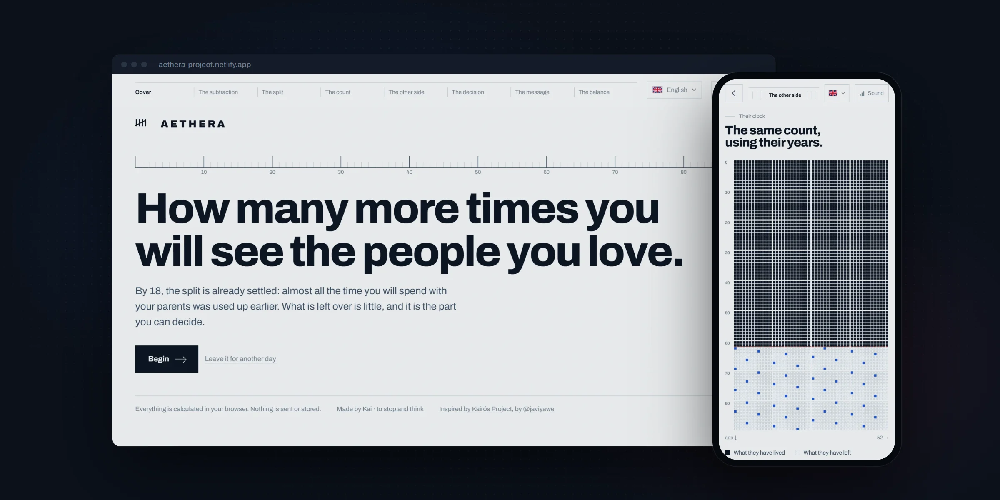
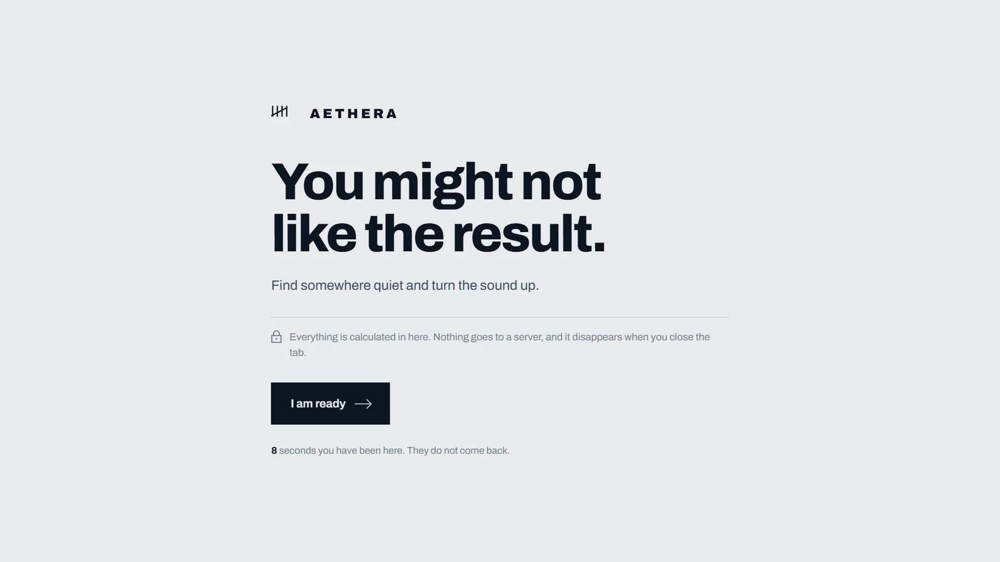
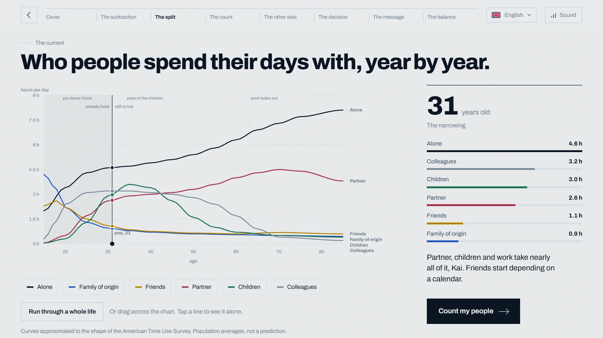
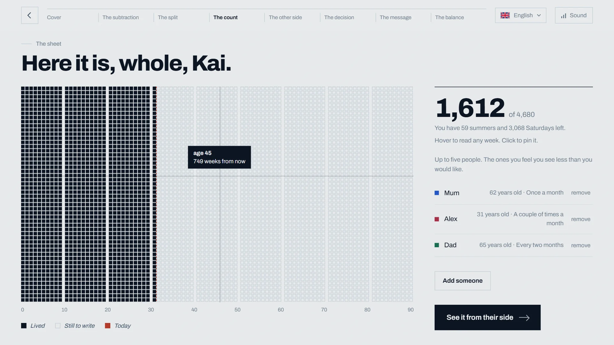
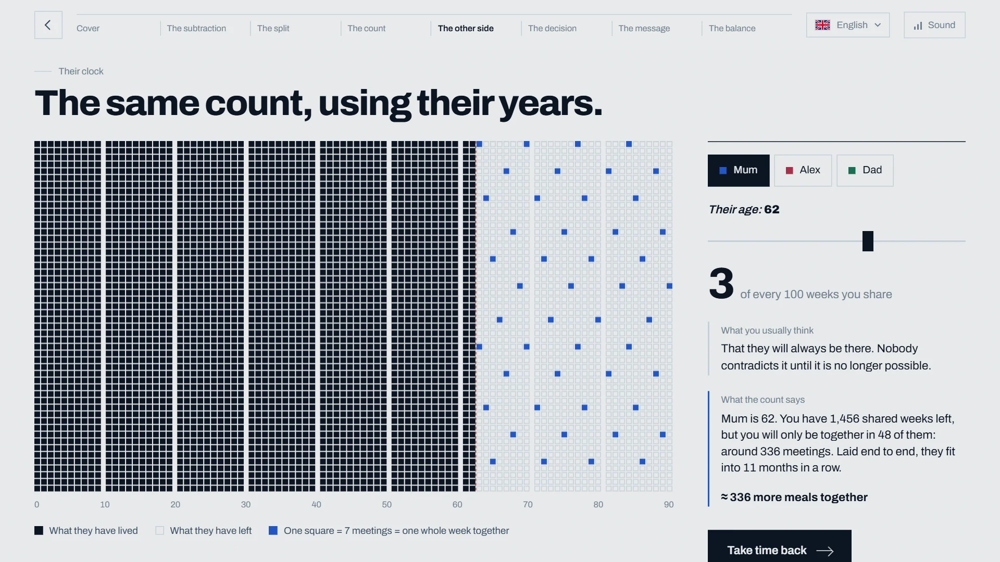
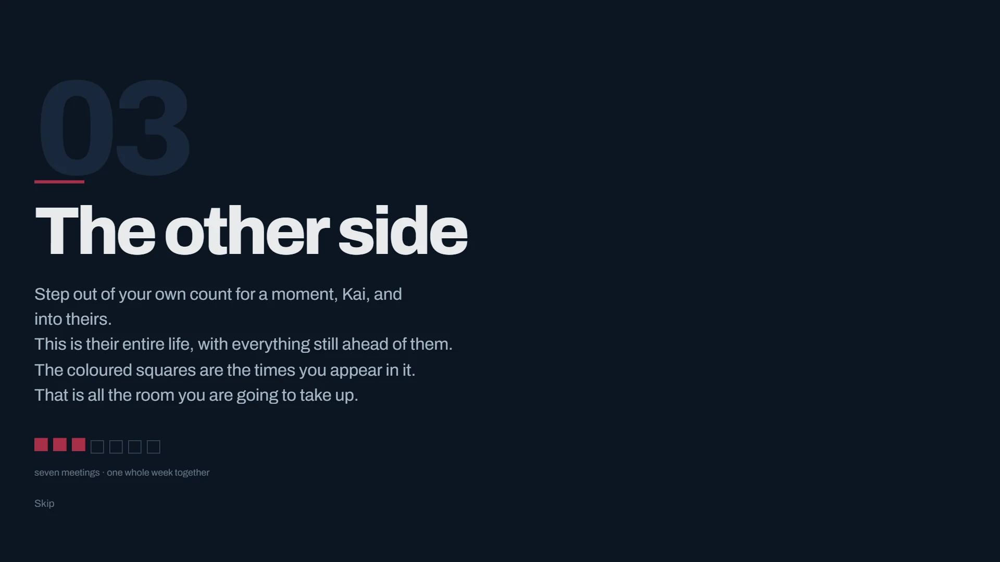
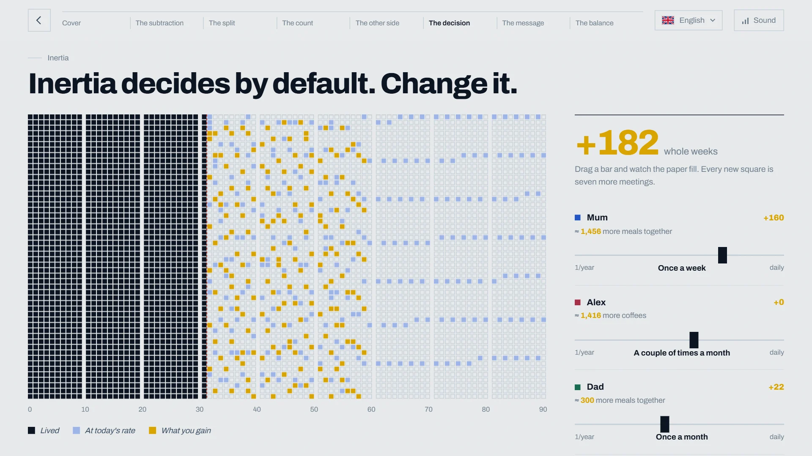
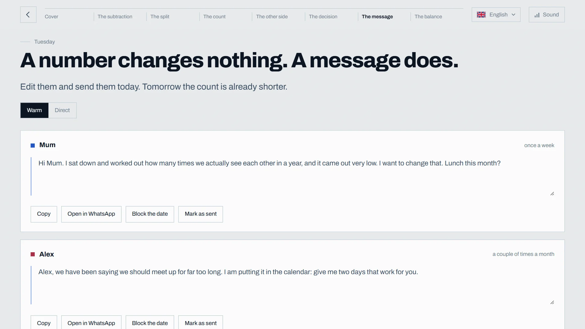
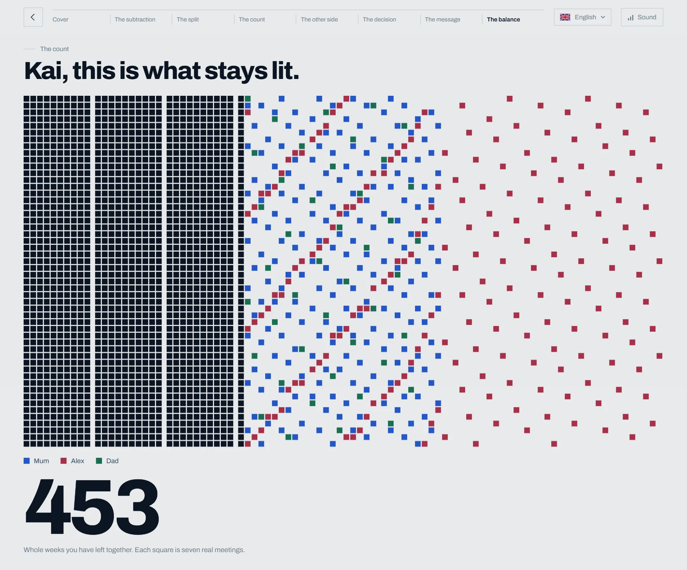

<div align="center">

<br>

# AETHERA

**How many more times will you see the people you love?**

<sub>Your life in weeks. Theirs, in the times you appear in it.</sub>

<br><br>

<a href="https://aethera-project.netlify.app/">
  
</a>

<br><br>

<a href="https://aethera-project.netlify.app/">
  
</a>
&nbsp;
<a href="https://github.com/Kaijove">
  
</a>

<br><br>

<sub>In your browser · 8 languages · No sign-up</sub>

<br>

</div>


## ✦ About

AETHERA starts with a subtraction.

Your age. Their age. How often you *really* see each other: a meal, a proper visit, a conversation without hurry.

What comes out is a number: the times you probably still have together. Before you begin, the page warns you that *you might not like the result.*

AETHERA exists because we put off the people who matter, as if there were always more time. For a few minutes, it shows you how much there actually is.

Then it hands the moment back to you.

<br>

## ⏳ Chronos → Kairós

The ancient Greeks had two words for time.

<table>
<tr>
<td valign="top">

### Chronos

**The time that passes.**

Weeks, birthdays, calendars.<br>
It keeps running either way.

</td>
<td valign="top">

### Kairós

**The moment that matters.**

The afternoon you stayed.<br>
The call you finally made.

</td>
</tr>
</table>

AETHERA starts in Chronos. It counts your life in weeks, one square at a time.

It ends in Kairós. With a message you can send today.

<br>

## 👥 What AETHERA shows you

**⌛ The time you've had, and the time that's left**<br>
Ninety years drawn as a single sheet, one square per week. The filled squares don't come back. The empty ones are the only ones you can still do something with.

**🌊 How a life gets shared out**<br>
Who people spend their hours with at every age. Family fades when you leave home. Friends start to depend on a calendar. Nobody chooses it. Age does.

**👥 The people who matter**<br>
Add up to five people. For each one you see the weeks you still share, and how many of those you'll actually spend together. Then you see it from their side: their whole life, and the room you take up in it.

**🎚️ What happens if you change**<br>
Move one slider. Once a month becomes once a week, and new squares light up. The numbers turn back into things: coffees, meals, afternoons.

**✉️ From a number to a message**<br>
The last step writes a message for each person. Warm or direct, yours to edit, ready to open in WhatsApp or to block a date in your calendar. A number changes nothing. A message does.

<details>
<summary><b>How the count works</b></summary>

<br>

- Reference horizon: **90 years = 4,680 weeks**, one square each.
- Weeks you still share: `min(90 − your age, 90 − their age) × 52`
- Meetings left: `meetings per year × years you share`
- **One square = 7 meetings = one whole week together.** Seven meetings, like the seven days of a week.

The time-use curves follow the shape of population data. These are averages, not a prediction about anyone.

</details>

<br>

## ✦ The Experience

### 🌌 The beginning



<sub>A warning, and a counter that keeps running while you decide.</sub>

<br>

### 🌊 The way time is shared



<sub>Hours a day with family, friends, partner, children and colleagues, age by age.</sub>

<br>

### ⏳ Your time



<sub>One square per week. The dark ones are already lived.</sub>

<br>

### 👥 The people who matter



<sub>Their life, seen from their side. The coloured squares are the times you appear in it.</sub>

<br>

### 🌑 The pauses



<sub>Between chapters the screen goes dark and speaks to you by name.</sub>

<br>

### 🎚️ The decision



<sub>Change how often you meet. Every yellow square is seven more meetings.</sub>

<br>

### ✉️ The message



<sub>Copy it, open it in WhatsApp, or block the date.</sub>

<br>

### ✦ What stays lit



<sub>Everything else switches off. Only the weeks you still share remain.</sub>

<br>

## 🔒 Privacy by design

AETHERA has no backend, no accounts and no database. Its code uses no cookies, no storage and no analytics.

- Your name, your age and the people you add are processed **only in your browser**.
- Nothing is saved, not even on your device. **Close the tab and it's gone.**
- Nothing leaves the page unless you decide it should: the WhatsApp button opens WhatsApp with your message, and *Block the date* downloads a calendar file.

<sub>The typeface loads from Google Fonts, and the hosting (Netlify) adds a small badge script of its own. AETHERA's code sends nothing to either.</sub>

<br>

## 🌅 The message

Nobody knows how much time they have left.

AETHERA doesn't pretend to. Its numbers are rough averages, and it says so. It's a warning, not a verdict.

What it changes is the unit.

A life counted in years feels long.<br>
The same life counted in the meals you still have with your parents doesn't.

That count goes down every day, whether you look at it or not.<br>
It only goes up one way: by showing up.

<br>

<div align="center">

### Chronos keeps counting. Kairós is up to you.

</div>

<br>

## 🛠️ Built with

<p>


</p>

One `index.html`. No framework, no build step, nothing to install. Open it in a browser and it works.

| Piece | Made with |
|---|---|
| **Weeks grid** | `<canvas>`, redrawn vertically on narrow screens |
| **Chart and ruler** | Inline SVG |
| **Soundtrack** | Web Audio API: a generative score (Am–F–G–Em pads, bass, random bells), no audio files |
| **Numbers** | `Intl.NumberFormat`, formatted for each language |
| **Sharing** | Clipboard API, WhatsApp links, `.ics` calendar files built with `Blob` |
| **Languages** | Castellano · Català · English · Français · Deutsch · Italiano · 日本語 · 中文 |
| **Typeface** | [Archivo](https://fonts.google.com/specimen/Archivo) |

<details>
<summary><b>Make it yours</b>: texts, languages, music</summary>

<br>

**Texts.** Every sentence lives in one object, `window.I18N`, at the top of `index.html`: one block per language, keys in alphabetical order. Find the key, change the value.

```js
"en": {
  "gTitle": "You might not like the result.",
  "in3s":   "Now you, {n}. We are going to subtract what you have already spent...",
}
```

Placeholders available inside the texts:

| Key | Meaning | Key | Meaning |
|-----|---------|-----|---------|
| `{n}` | your name | `{p}` | their name |
| `{a}` | their age | `{s}` | weeks you share |
| `{c}` | weeks together | `{m}` | number of meetings |
| `{r}` | all that time back to back | `{y}` | years |
| `{w}` | weeks | `{u}` | human unit (coffees, meals…) |

Key groups: `sec0`–`sec7` top-bar sections · `in2t`/`in2s` … `in7t`/`in7s` the pauses between screens · `ph0n`–`ph5n` and `ph0r`–`ph5r` chart stages · `rf1`–`rf5` closing lines · `frq_*` frequencies · `rel_*` relationships · `unit_*` human units · `ser_*` chart series · `mw_*` / `md_*` warm and direct messages.

**A new language.** Copy the whole `"es"` block, rename the key to your language code, translate the values, then add the code to `LANGS` and an SVG flag to `FLAG` in the second `<script>`.

**Your own music.** Put a file called `ambient.mp3` next to `index.html` and it plays in a loop instead of the generative score. Only use music you have the rights to.

</details>

<br>

<div align="center">

## 🌐 Experience AETHERA

### [aethera-project.netlify.app](https://aethera-project.netlify.app/)

<sub>Find somewhere quiet. Turn the sound up. Think of someone.</sub>

<br>

</div>

## ✦ Credits

Inspired by **Kairós Project**, the original experience by [@javiyawe](https://www.instagram.com/javiyawe) · [more of their work](https://links.javiyawe.es/).<br>
If you liked the idea, the idea is theirs. Go and see it.

Made by **Kai**, written from scratch. Code, words, design, palette, sound and structure are its own, with nothing reused from the original: the same question, asked a different way.

Counting a life in weeks comes from a long tradition: *life in weeks* notebooks and Tim Urban's essay [The Tail End](https://waitbutwhy.com/2015/12/the-tail-end.html).

Time-use curves approximated from the [American Time Use Survey](https://www.bls.gov/tus/) (U.S. Bureau of Labor Statistics) and [Our World in Data](https://ourworldindata.org/time-use).

## License

Code and text under the [MIT License](LICENSE). Linked data belongs to its sources. If you add music or images, make sure you can license them.
