<a name="top"></a>

<p align="center">
  <a href="https://aethera-project.netlify.app/"><picture><source media="(prefers-color-scheme: dark)" srcset="docs/assets/readme/btn-live-lg-dark.png"></picture></a>
</p>

<p align="center">
  <a href="https://github.com/Kaijove/AETHERA/blob/main/index.html"><picture><source media="(prefers-color-scheme: dark)" srcset="docs/assets/readme/btn-source-dark.png"></picture></a>
  <a href="#under-the-hood"><picture><source media="(prefers-color-scheme: dark)" srcset="docs/assets/readme/btn-docs-dark.png"></picture></a>
</p>

<p align="center">
  <a href="https://aethera-project.netlify.app/">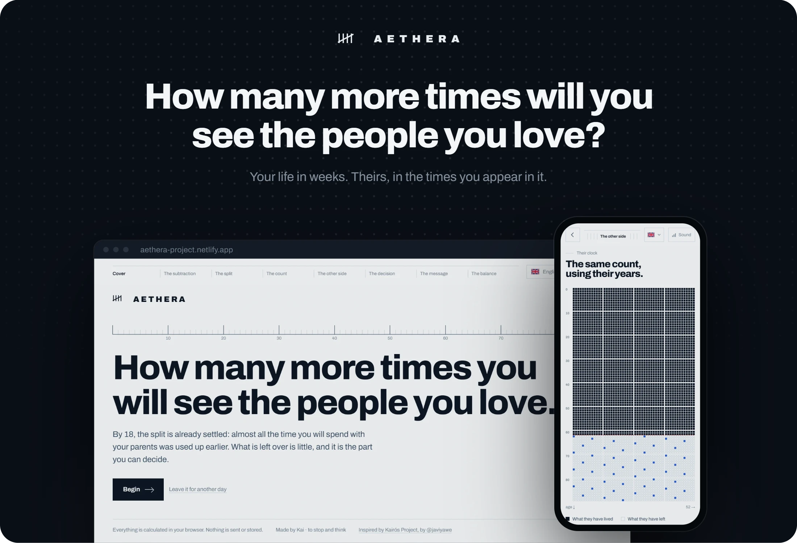</a>
</p>

<p align="center">
  An interactive piece about time, and the people you still have it with.<br>
  <sub>In your browser &nbsp;·&nbsp; 8 languages &nbsp;·&nbsp; No sign-up &nbsp;·&nbsp; Best with the sound on</sub>
</p>

<p align="center">
  <a href="#experience"><picture><source media="(prefers-color-scheme: dark)" srcset="docs/assets/readme/btn-explore-dark.png"></picture></a>
</p>

<p align="center"><picture><source media="(prefers-color-scheme: dark)" srcset="docs/assets/readme/divider-dark.png"></picture></p>

<a name="idea"></a>
<h3 align="center"><sub>01 &nbsp;/&nbsp; THE IDEA</sub><br>Two words for time.</h3>

<p align="center">
  AETHERA starts in Chronos, counting your life in weeks.<br>
  It ends in Kairós, with a message you can send today.
</p>

<p align="center"><picture><source media="(prefers-color-scheme: dark)" srcset="docs/assets/readme/idea-dark.webp">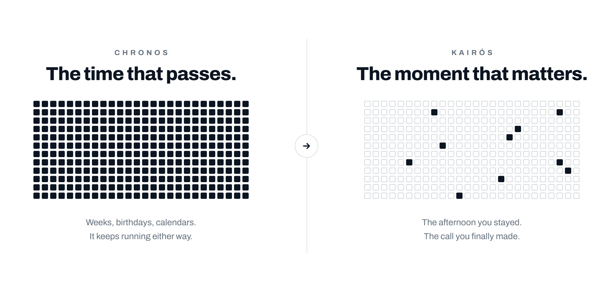</picture></p>

<p align="center"><picture><source media="(prefers-color-scheme: dark)" srcset="docs/assets/readme/divider-dark.png"></picture></p>

<h3 align="center"><sub>02 &nbsp;/&nbsp; WHY AETHERA</sub><br>We think there's always time.</h3>

<p align="center">
  <i>“That they will always be there.”</i><br>
  <i>“That friendship keeps itself going, without dates.”</i><br>
  <i>“That there will be a better moment than this one.”</i>
</p>

<p align="center">
  That's what we usually think. It's why <i>another day</i> always wins.<br>
  AETHERA does the maths instead, quietly, for a few minutes.<br>
  Then it hands the moment back to you.
</p>

<p align="center"><picture><source media="(prefers-color-scheme: dark)" srcset="docs/assets/readme/divider-dark.png"></picture></p>

<a name="experience"></a>
<h3 align="center"><sub>03 &nbsp;/&nbsp; THE EXPERIENCE</sub><br>Seven chapters. One question.</h3>

<p align="center"><picture><source media="(prefers-color-scheme: dark)" srcset="docs/assets/readme/chapters-dark.webp">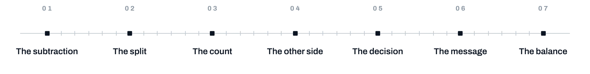</picture></p>

<p align="center">
  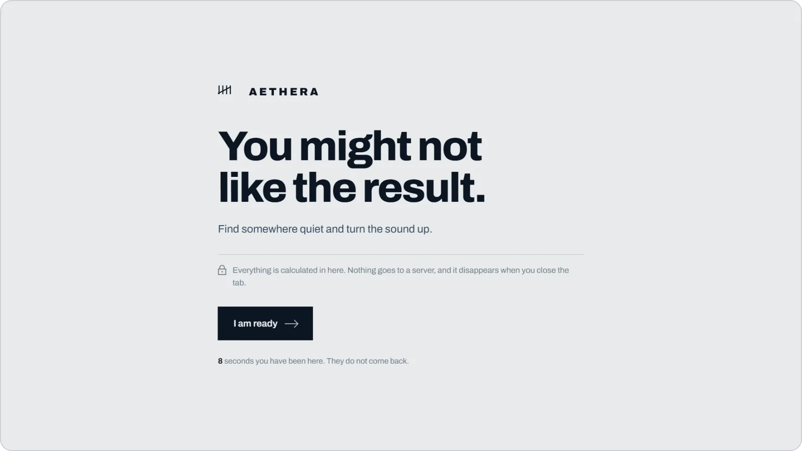
  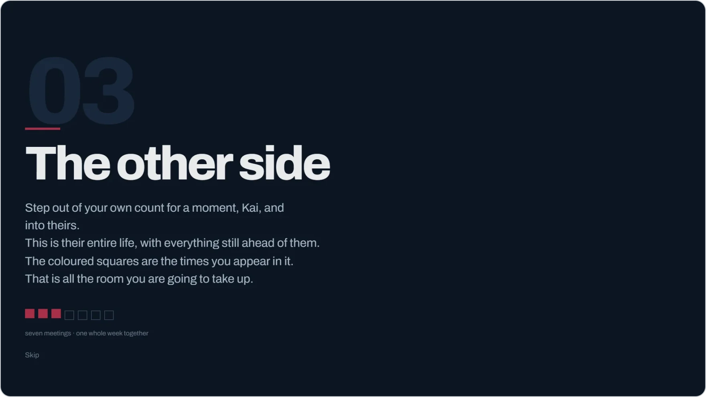
  <br>
  <sub><b>BEFORE</b> &nbsp;·&nbsp; a warning, and a counter that keeps running &emsp;&emsp; <b>BETWEEN</b> &nbsp;·&nbsp; the screen goes dark and speaks to you by name</sub>
</p>

<p align="center">
  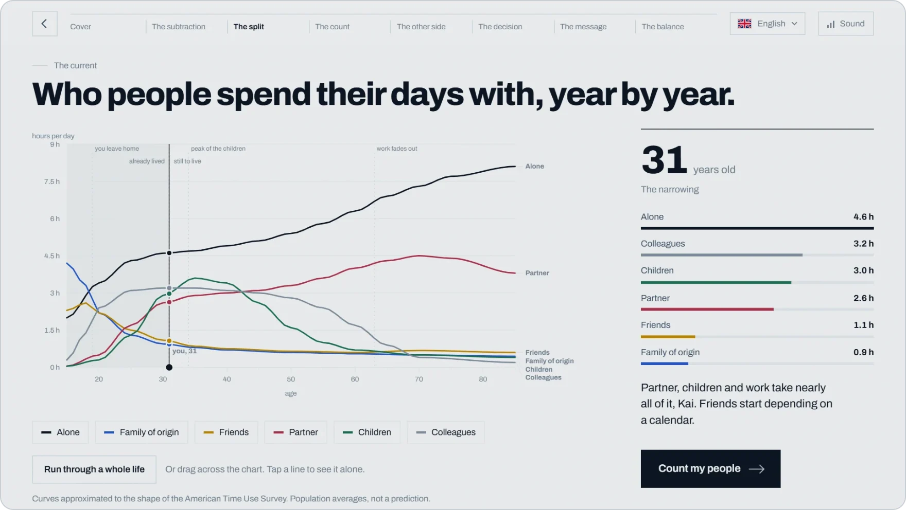
  <br>
  <sub><b>02 · THE SPLIT</b> &nbsp;·&nbsp; who people spend their days with, year by year</sub>
</p>

<p align="center">
  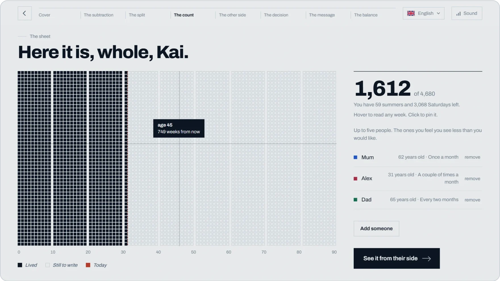
  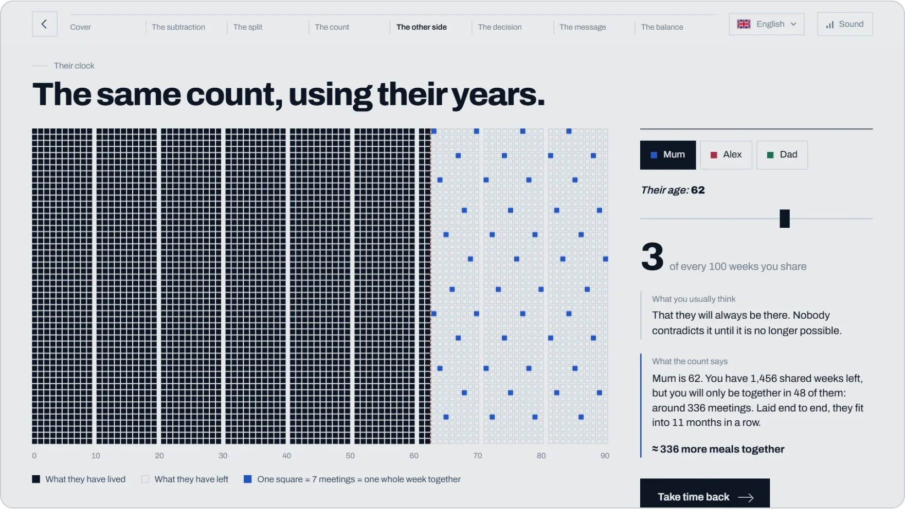
  <br>
  <sub><b>03 · THE COUNT</b> &nbsp;·&nbsp; your life in weeks &emsp;&emsp; <b>04 · THE OTHER SIDE</b> &nbsp;·&nbsp; theirs, and the times you appear in it</sub>
</p>

<p align="center">
  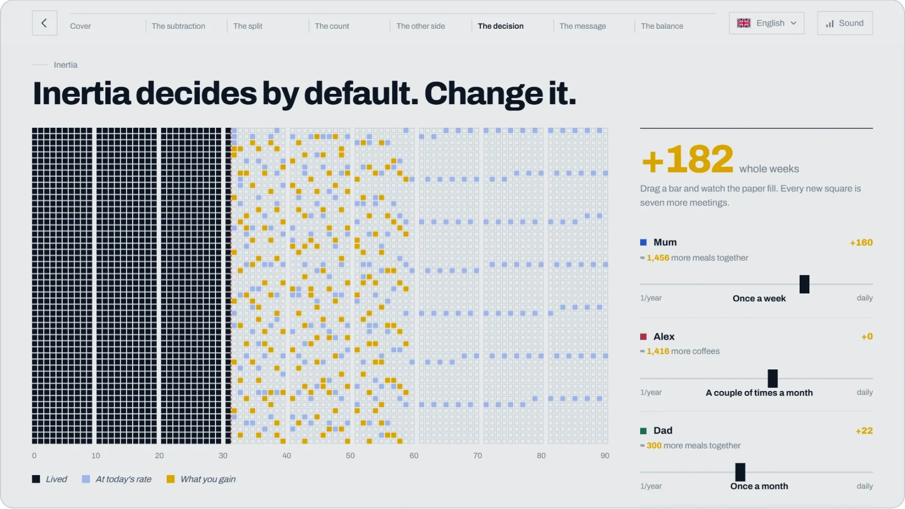
  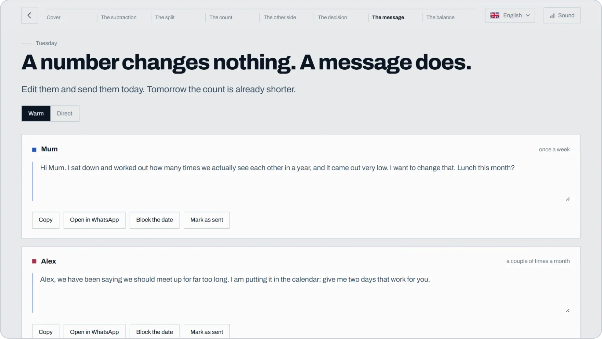
  <br>
  <sub><b>05 · THE DECISION</b> &nbsp;·&nbsp; every new square is seven more meetings &emsp;&emsp; <b>06 · THE MESSAGE</b> &nbsp;·&nbsp; warm or direct, sent today</sub>
</p>

<p align="center">
  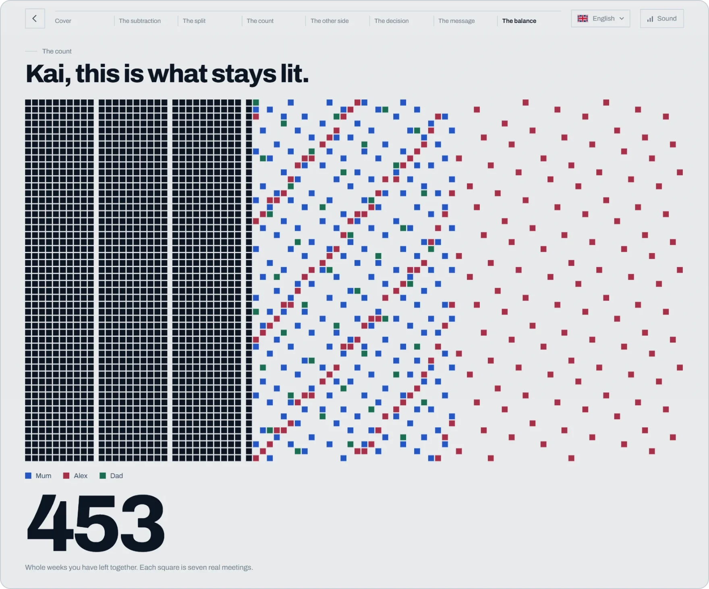
  <br>
  <sub><b>07 · THE BALANCE</b> &nbsp;·&nbsp; everything else switches off, and only the weeks you still share stay lit</sub>
</p>

<p align="center">
  <a href="https://aethera-project.netlify.app/"><picture><source media="(prefers-color-scheme: dark)" srcset="docs/assets/readme/btn-experience-dark.png"></picture></a>
</p>

<p align="center"><picture><source media="(prefers-color-scheme: dark)" srcset="docs/assets/readme/divider-dark.png"></picture></p>

<h3 align="center"><sub>04 &nbsp;/&nbsp; FEATURES</sub><br>Small numbers. Real people.</h3>

<p align="center"><picture><source media="(prefers-color-scheme: dark)" srcset="docs/assets/readme/features-dark.webp">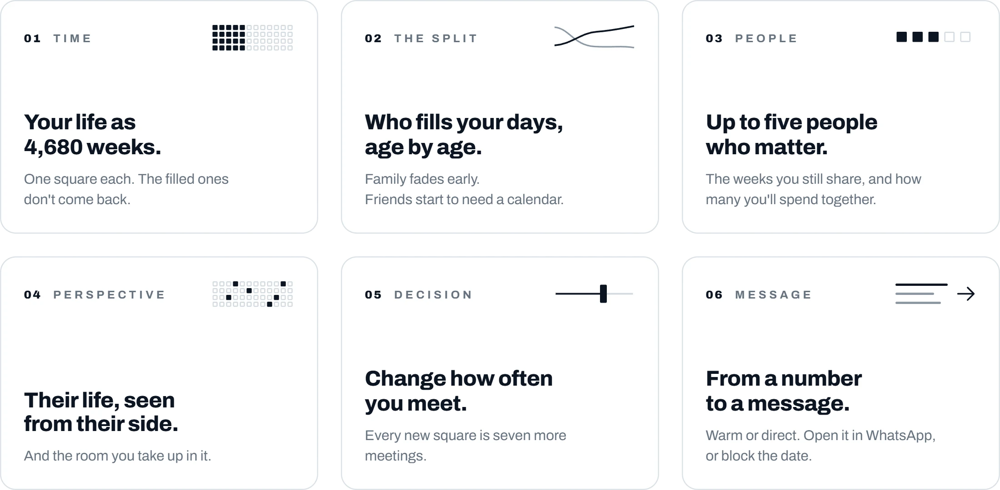</picture></p>

<details>
<summary><b>How the count works</b></summary>

<br>

- Reference horizon: **90 years = 4,680 weeks**, one square each.
- Weeks you still share: `min(90 − your age, 90 − their age) × 52`
- Meetings left: `meetings per year × years you share`
- **One square = 7 meetings = one whole week together.** Seven meetings, like the seven days of a week.

The time-use curves follow the shape of population data. These are averages, not a prediction about anyone.

</details>

<p align="center"><picture><source media="(prefers-color-scheme: dark)" srcset="docs/assets/readme/divider-dark.png"></picture></p>

<h3 align="center"><sub>05 &nbsp;/&nbsp; PRIVACY</sub><br>Nothing leaves your browser unless you send it.</h3>

<p align="center">
  No backend. No accounts. No database.<br>
  No cookies, no storage and no analytics in the code.<br>
  <b>Close the tab and it's gone.</b>
</p>

<p align="center">
  <sub>The typeface loads from Google Fonts, and Netlify adds its own badge script to the hosted page.<br>The WhatsApp and calendar buttons only act when you press them.</sub>
</p>

<p align="center"><picture><source media="(prefers-color-scheme: dark)" srcset="docs/assets/readme/divider-dark.png"></picture></p>

<a name="under-the-hood"></a>
<h3 align="center"><sub>06 &nbsp;/&nbsp; BUILT WITH</sub><br>One file. No dependencies.</h3>

<p align="center"><picture><source media="(prefers-color-scheme: dark)" srcset="docs/assets/readme/built-dark.webp"></picture></p>

<details>
<summary><b>Make it yours</b>: texts, languages, music</summary>

<br>

**Texts.** Every sentence lives in one object, `window.I18N`, at the top of `index.html`: one block per language, keys in alphabetical order. Find the key, change the value.

```js
"en": {
  "gTitle": "You might not like the result.",
  "in3s":   "Now you, {n}. We are going to subtract what you have already spent...",
}
```

Placeholders available inside the texts:

| Key | Meaning | Key | Meaning |
|-----|---------|-----|---------|
| `{n}` | your name | `{p}` | their name |
| `{a}` | their age | `{s}` | weeks you share |
| `{c}` | weeks together | `{m}` | number of meetings |
| `{r}` | all that time back to back | `{y}` | years |
| `{w}` | weeks | `{u}` | human unit (coffees, meals…) |

Key groups: `sec0`–`sec7` top-bar sections · `in2t`/`in2s` … `in7t`/`in7s` the pauses between screens · `ph0n`–`ph5n` and `ph0r`–`ph5r` chart stages · `rf1`–`rf5` closing lines · `frq_*` frequencies · `rel_*` relationships · `unit_*` human units · `ser_*` chart series · `mw_*` / `md_*` warm and direct messages.

**A new language.** Copy the whole `"es"` block, rename the key to your language code, translate the values, then add the code to `LANGS` and an SVG flag to `FLAG` in the second `<script>`.

**Your own music.** Put a file called `ambient.mp3` next to `index.html` and it plays in a loop instead of the generative score. Only use music you have the rights to.

</details>

<p align="center"><picture><source media="(prefers-color-scheme: dark)" srcset="docs/assets/readme/divider-dark.png"></picture></p>

<h3 align="center"><sub>07 &nbsp;/&nbsp; THE THOUGHT</sub><br>It only changes the unit.</h3>

<p align="center">
  Nobody knows how much time they have left.<br>
  AETHERA doesn't pretend to. Its numbers are averages, and it says so.
</p>

<p align="center">
  A life counted in years feels long.<br>
  The same life counted in the meals you still have with your parents doesn't.
</p>

<p align="center"></p>

<br>

<h2 align="center">How many more times will you see<br>the people you love?</h2>

<p align="center">
  <a href="https://aethera-project.netlify.app/"><picture><source media="(prefers-color-scheme: dark)" srcset="docs/assets/readme/btn-live-lg-dark.png"></picture></a>
</p>

<p align="center">
  <a href="https://github.com/Kaijove/AETHERA/blob/main/index.html"><picture><source media="(prefers-color-scheme: dark)" srcset="docs/assets/readme/btn-source-dark.png"></picture></a>
  <a href="#top"><picture><source media="(prefers-color-scheme: dark)" srcset="docs/assets/readme/btn-top-dark.png"></picture></a>
</p>

<br>

<p align="center">
  <sub>
    Made by <b>Kai</b>. Inspired by <b>Kairós Project</b>, the original experience by <a href="https://www.instagram.com/javiyawe">@javiyawe</a> · <a href="https://links.javiyawe.es/">more of their work</a>.<br>
    If you liked the idea, the idea is theirs. This version was written from scratch: its own code, words, design, palette, sound and structure.<br>
    Counting a life in weeks comes from <i>life in weeks</i> notebooks and Tim Urban's <a href="https://waitbutwhy.com/2015/12/the-tail-end.html">The Tail End</a>.<br>
    Time-use curves approximated from the <a href="https://www.bls.gov/tus/">American Time Use Survey</a> and <a href="https://ourworldindata.org/time-use">Our World in Data</a>.<br>
    Code and text under the <a href="LICENSE">MIT License</a>. Linked data belongs to its sources.
  </sub>
</p>
